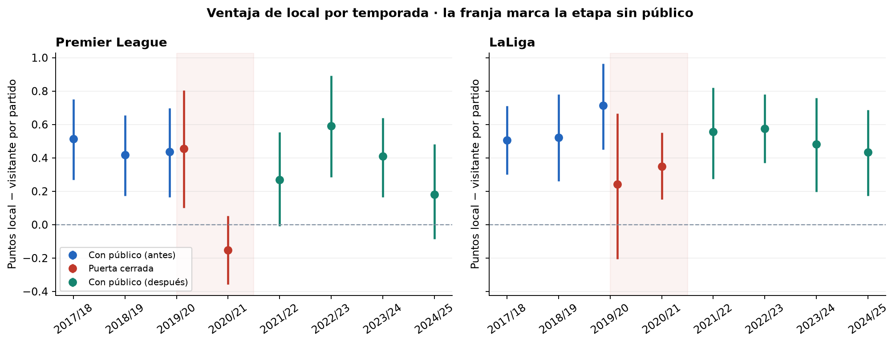

# Football Odds Calibration

**Auditoría de probabilidades de cierre y ventaja de local en Premier League y LaLiga.**

Proyecto de análisis de datos que evalúa la calidad de los pronósticos de Bet365 y Pinnacle, la sensibilidad al retirar el margen y los cambios de ventaja de local durante la pandemia. Incluye validación de datos, comparaciones apareadas, incertidumbre temporal y un reporte reproducible.



## Resultados principales

| Análisis | Resultado | Interpretación |
|---|---|---|
| Calibración, 2022/23–2024/25 | ECE medio por resultado de 2,59–2,98 pp con potencia | Desviaciones promedio moderadas; dependen del agrupamiento |
| Calidad de pronósticos | Mejora de RPS del 16,1–18,1 % frente a frecuencias históricas | Mayor calidad global; no demuestra rentabilidad |
| Sesgo favorito–longshot | 0 de 16 pendientes significativas tras Holm | Evidencia insuficiente para afirmar sesgo sistemático en estos contrastes |
| Ligas y temporadas | 0 de 24 y 0 de 96 contrastes significativos, respectivamente | No se detectan diferencias concluyentes; no prueba equivalencia |
| Público local, 2017/18–2024/25 | Premier: ventaja en puntos de 0,40 a −0,01; LaLiga: de 0,53 a 0,32 | La caída en puntos es concluyente en Premier; en LaLiga el respaldo más claro está en remates y goles ajustados |

La comparación de público usa los periodos anterior y posterior agrupados frente a puerta cerrada. Los puntos representan **puntos del local menos puntos del visitante por partido**. El diseño observacional no permite atribuir todo el cambio exclusivamente al público.

## Explorar el análisis

- [Resumen ejecutivo](reports/executive_summary.md): hallazgos y límites de interpretación.
- [Reporte completo](reports/index.html): descargar y abrir en el navegador; contiene gráficos incorporados y enlaces a tablas locales.
- [Hallazgos calculados](reports/findings.md): resultados generados desde las tablas.
- [Metodología](docs/METHODOLOGY.md), [diccionario](docs/DATA_DICTIONARY.md) y [referencias](docs/REFERENCES.md).

GitHub muestra el código del HTML. Para leerlo con formato, clone o descargue el repositorio y abra `reports/index.html`.

## Datos y alcance

Football-Data.co.uk; dos ligas, dos operadores y cuatro métodos de remoción del margen: proporcional, potencia, aditivo y Shin.

- Calibración: **2.280 partidos únicos**, seis temporadas liga–año, 4.560 registros partido–operador y cobertura común completa.
- Público local: **6.080 partidos únicos**, dieciséis temporadas liga–año. Incluye los partidos de calibración; los tamaños no se suman.
- Bet365 carece de cuotas de cierre en los archivos anteriores a 2019/20. Pinnacle tiene un partido histórico sin cuota válida. No se imputan cuotas.
- Validaciones: fechas, resultados coherentes con goles, duplicados, 380 partidos por temporada, 20 clubes, 38 apariciones por club y cuotas elegibles.

Los originales recibidos localmente se identifican mediante SHA-256. Su fecha original de descarga es desconocida y se declara como tal. Una descarga posterior puede diferir del snapshot entregado: el flujo detecta esa diferencia. Consulte [procedencia y reproducción](data/README.md).

## Reproducir

Python 3.11 o posterior. Desde la raíz:

```bash
python -m venv .venv
# PowerShell: .venv\Scripts\Activate.ps1
# Linux/macOS: source .venv/bin/activate
python -m pip install -r requirements.txt
python download_data.py
python run_all.py
python -m unittest discover -s tests -v
```

`download_data.py` obtiene las dieciséis bases configuradas y conserva archivos existentes. La ejecución final usa **2.000 réplicas**, bloques de 20 partidos y semilla fija. `python run_all.py --bootstrap-reps 200` es una comprobación rápida y no reproduce la incertidumbre de la entrega final. `requirements-lock.txt` documenta el entorno de referencia.

## Estructura

```text
football-odds-calibration/
├── .github/workflows/     # comprobaciones automáticas
├── data/
│   ├── processed/         # bases analíticas publicadas
│   ├── raw/               # originales recientes, excluidos de Git
│   ├── raw_covid/          # originales históricos, excluidos de Git
│   └── *manifest.csv      # procedencia y huellas
├── docs/                  # metodología, variables y referencias
├── reports/
│   ├── index.html         # reporte completo
│   ├── executive_summary.md
│   ├── figures/           # gráficos PNG/SVG
│   └── tables/            # resultados y sensibilidad
├── src/                   # carga, métodos, inferencia y reportes
├── tests/                 # controles numéricos y de integración
├── config.json
├── download_data.py
├── run_all.py
└── requirements.txt
```

## Decisiones y límites

El remuestreo preserva bloques cronológicos y compara casas sobre los mismos partidos. Holm controla comparaciones dentro de familias declaradas. Se examinan tamaños de bloque, agrupamientos, umbrales y métodos alternativos.

Cambiar el método de retirada del margen modifica mecánicamente el contraste entre extremos cuando los grupos son fijos; no identifica el reparto real del margen. La referencia histórica es retrospectiva, no una simulación prospectiva. Las tarjetas y remates son indicadores compatibles con posibles mecanismos, no pruebas causales. Las ventanas de asistencia son aproximaciones por fecha; la pandemia también cambió calendario, descansos y viajes.

## Créditos y condiciones de uso

Contribución conjunta de **Mauricio Serrano, Andrés Beleño y Carlos Cadena**. Fuentes y métodos externos se atribuyen en la documentación. Los datos proceden de Football-Data.co.uk y conservan sus condiciones originales; este repositorio no concede una licencia nueva sobre ellos. No se declara una licencia de código sin acuerdo entre sus autores.

Este análisis evalúa pronósticos históricos. No ofrece recomendaciones de apuestas.
